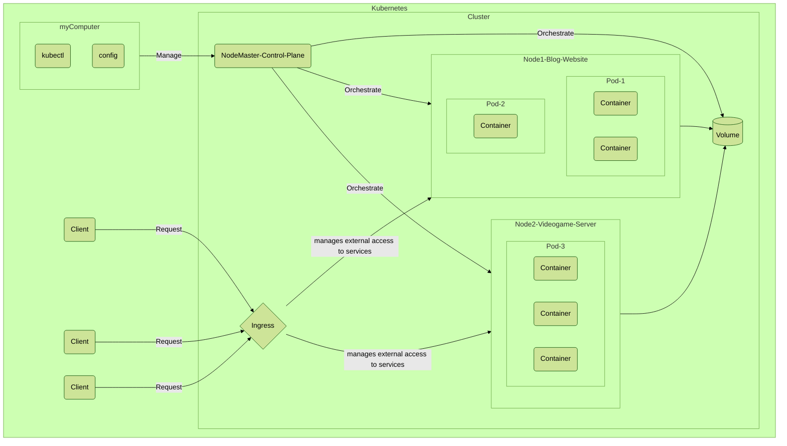

```mermaid
%%{init: {'theme':'forest'}}%%
graph
    subgraph Kubernetes
    Client1(Client) -- Request --> Ingress{Ingress}
    Client2(Client) -- Request --> Ingress
    Client3(Client) -- Request --> Ingress
    subgraph "Cluster"
    NodeMaster-Control-Plane
    Ingress -- manages external access to services --> Node1-Blog-Website
    Ingress -- manages external access to services --> Node2-Videogame-Server
    subgraph "Node1-Blog-Website"
    Pod-1
    subgraph Pod-1
    Container1(Container)
    Container2(Container)
    end
    Pod-2
    subgraph "Pod-2"
    Container3(Container)
    end
    end
    subgraph "Node2-Videogame-Server"
    Pod-3
    subgraph "Pod-3"
    Container4(Container)
    Container5(Container)
    Container6(Container)
    end
    end
    Node1-Blog-Website --> Volume[(Volume)]
    Node2-Videogame-Server --> Volume
    NodeMaster-Control-Plane -- Orchestrate --> Volume
    NodeMaster-Control-Plane -- Orchestrate --> Node1-Blog-Website
    NodeMaster-Control-Plane -- Orchestrate --> Node2-Videogame-Server
    end
    myComputer -- Manage --> NodeMaster-Control-Plane(NodeMaster-Control-Plane)
    subgraph "myComputer"
    kubectl(kubectl)
    config(config)
    end
    end
```
